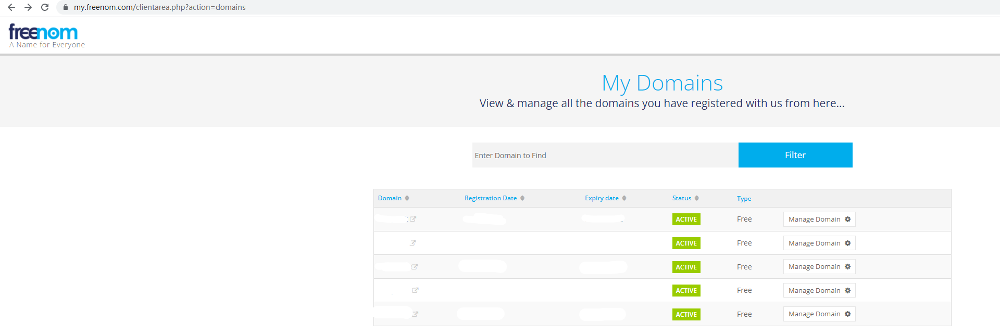
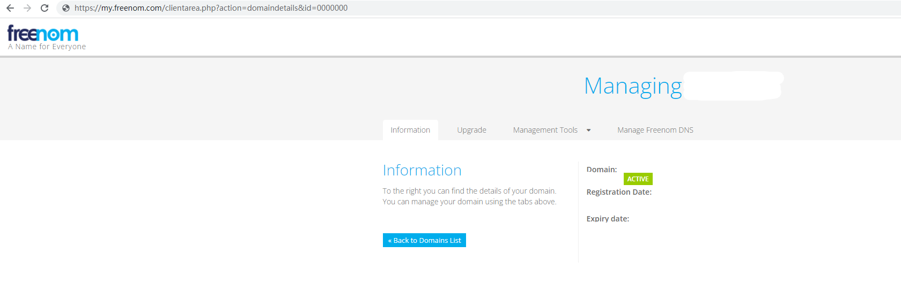

# Freenom DDNS

一个可以自动更新ip到Freenom的shell。

# 介绍

DDNS服务很多，但得到的都是二级域名，这样有的时候可能不方便。

如果家里有公网IP，又有[Freenom](https://freenom.com/)免费域名，为何不利用起来呢。

众所周知，DDNS服务商更新IP的原理其实就是：

请求一个获取IP的URL **&rarr;** 获取到IP **&rarr;** 将IP放到DDNS更新URL **&rarr;** 向连接发送一个get请求

例如[dynv6](https://dynv6.com/)的更新URL是这样的

      http://dynv6.com/api/update?hostname=<domain>&token=<username>&ipv4=<ipaddr>

所以如果获取到[Freenom](https://freenom.com/)更新IP的URL及参数，那么就可以通过cURL像更新DDNS一样轻松更新更新IP地址了。

# 配置

将这个**freenom_ddns.sh**复制或者创建到目标位置，然后修改里面的参数。

`freenom_email` = Freenom账号

`freenom_passwd` = Freenom密码

`freenom_domain_name` = 需要更新的Freenom域名（当然，这必须是账号里的域名）

`freenom_domain_id` = 目标域名的ID，这个可以在管理界面的链接里找到（不懂可以翻看下面）

倒数第四行的`/scripts/shell/tgpush.sh` 这是一个使用tg bot推送消息的shell，通知运行结果，可以在[TelegramBotPush](https://github.com/PineappleBeer/TelegramBotPush)里了解。

# 使用

例如这个shell的位置是`/scripts/shell/freenom_ddns.sh`

      bash /scripts/shell/freenom_ddns.sh

# 获取Freenom Domain ID

首先打开[管理界面](https://my.freenom.com/clientarea.php?action=domains)

点击`Manage Domain`进去及就可以看到

地址栏的`id`就是我们要的ID了

# cURL命令详解
`--compressed`：curl自动解压缩响应页面（页面是压缩的话，例如目标服务器设置了gzip压缩了页面）。

`-k`：允许不使用证书到SSL站点

`-L `：当页面需要重定向时，curl自动跟踪重定向响应

`-e `：服务端看到的请求来源地址

`-c`：请求成功后，将cookie保存到目标文件

`-F`：模拟HTTP表单提交

`-b`：cookie读取位置